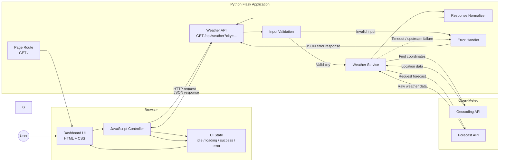
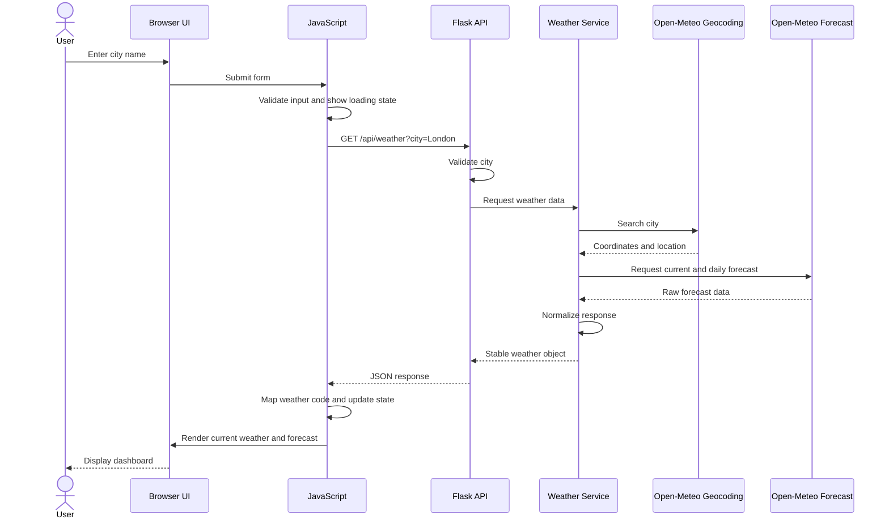

## Plan: Minimal Weather Dashboard

The workspace `c:\co-pilot\septappnew` is empty. Start with a deliberately small Flask application: Flask serves the page and exposes a `/api/weather` endpoint that looks up the requested city and fetches forecast data from Open-Meteo. The browser only calls the Flask endpoint, giving the Python backend ownership of upstream requests and error normalization.

**Steps**
1. Create a Python environment and dependency manifest with Flask and Requests as the runtime dependencies.
2. Add `app.py` with a Flask application factory or simple app instance, a root route rendering `templates/index.html`, and development startup support guarded by `if __name__ == '__main__'`.
3. Add `templates/index.html` containing a city search form, accessible status/error region, current-weather panel, forecast list, and links to the stylesheet and JavaScript bundle.
4. Add `static/css/styles.css` with responsive layout, clear loading/error/empty states, and stable weather metric/forecast styling.
5. Add `static/js/app.js` with form handling, input validation, a request to Flask `/api/weather`, abort or stale-request protection, and DOM rendering through text-safe APIs.
6. Add a concise `README.md` covering setup, startup, endpoints used, browser/network prerequisites, and the fact that Open-Meteo is a third-party dependency.
7. Optionally add `.gitignore` for `.venv`, Python caches, local environment files, and editor metadata.

**Relevant files**
- `c:\co-pilot\septappnew\app.py` — Flask entry point and page route; no existing implementation or convention to reuse.
- `c:\co-pilot\septappnew\templates\index.html` — accessible dashboard shell and semantic target elements for JavaScript rendering.
- `c:\co-pilot\septappnew\static\css\styles.css` — responsive visual layout and state styling.
- `c:\co-pilot\septappnew\static\js\app.js` — Open-Meteo geocoding/forecast requests and UI state transitions.
- `c:\co-pilot\septappnew\requirements.txt` — minimal pinned-or-compatible Flask dependency.
- `c:\co-pilot\septappnew\README.md` — setup and usage documentation.
- `c:\co-pilot\septappnew\.gitignore` — optional local-development exclusions.

**API/backend considerations**
- Add Flask `GET /api/weather?city=...`; reject missing or overly long input with a clear 400 JSON response.
- In Flask, call Open-Meteo geocoding with `name`, `count=1`, and `language=en`, then call the forecast endpoint with `current=temperature_2m,relative_humidity_2m,apparent_temperature,weather_code,wind_speed_10m`, `daily=weather_code,temperature_2m_max,temperature_2m_min,sunrise,sunset`, `forecast_days=5`, and `timezone=auto`.
- Set a reasonable upstream timeout, handle no geocoding result, non-OK responses, malformed JSON, and unexpected upstream failures, and return normalized JSON plus appropriate 4xx/5xx status codes.
- Keep the browser responsible only for form interaction and rendering. Disable or label the submit action while a request is active and ignore stale responses using an `AbortController` or request sequence.
- Render user/upstream values with `textContent` and DOM creation rather than injecting untrusted strings into `innerHTML`. Validate finite latitude/longitude values before the forecast request.
- Map WMO weather codes to human-readable labels/icons locally; include units and the selected city/country/timezone in the UI. Display the attribution/license information required by Open-Meteo in the page footer.
- Flask serves `/`, static assets, and the weather API; no authentication, persistence, caching, or rate limiting is included in this prototype.

**Architecture diagram**

**Data-flow diagram**

**Verification**
1. From `c:\co-pilot\septappnew`, run `py -m venv .venv`, activate with `\.venv\Scripts\Activate.ps1`, and install with `py -m pip install -r requirements.txt`.
2. Run `py app.py` and open `http://127.0.0.1:5000/`.
3. Confirm the page loads, static CSS/JavaScript requests return successfully, an ordinary city search renders current conditions and five forecast days, and an unknown city shows a readable error without stale data.
4. Use browser developer tools Network/Console panels to confirm the browser calls only `/api/weather`, the Flask logs show upstream requests with `timezone=auto`, no uncaught errors occur, and no mixed-content issue appears.
5. Run `py -m compileall app.py` and optionally `py -m pip check`; if tests are later added, run `py -m pytest`.
6. Check responsive behavior at a narrow mobile viewport and a desktop viewport; verify keyboard form submission, visible focus, status announcements, and that long city names do not overflow.

**Decisions**
- Scope is a single-city dashboard with city-name search and a five-day forecast; no persistence, authentication, maps, charts, or weather history in the first version.
- The workspace is empty, so conventional Flask folders (`templates/`, `static/`) are recommended without needing migration work.
- Use vanilla JavaScript and browser Fetch; do not add a frontend build system.
- Prefer a simple app instance for the first implementation unless tests or deployment requirements call for an application factory.

**Further Considerations**
1. Production deployment should use a WSGI server such as Waitress or Gunicorn-equivalent rather than Flask's development server.
2. Add server-side tests for the root route and JavaScript-level/browser tests only if the dashboard grows beyond the minimal prototype.
3. Confirm current Open-Meteo attribution and rate-limit requirements before publishing publicly.
